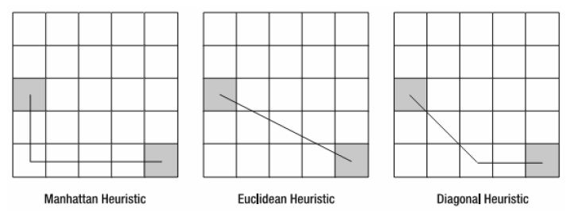

  A Star算法，实际上是一个寻路算法，常用于游戏的寻找路径，我们通常也称其为A星算法。当然啦
，我只是在看算法的时候，被领导叫去看这个算法的。乍看之下蛮简单的，实现起来，考虑的可能
会稍微多那么一点点东西。

主要参考：

1、博客园莫水千流的[A星寻路算法介绍](https://www.cnblogs.com/zhoug2020/p/3468167.html)

2、博客园我爱我家喵喵的[UnityA-Star(A星)寻路算法](https://www.cnblogs.com/yangyxd/articles/5447889.html)


通过阅读可以发现，A星算法原理并不难，主要步骤如下：
1、设置起点、终点
2、需要两张表，open表用来存储被考虑的点，close表用来存储障碍点
3、从起点开始，计算以起点为中心的F量，选择最小的F量，不断循环
4、直到找到终点，然后再返回该路径。

G量：是衡量行走的难度的计算，通常为了计算方便，走上下左右用10来表示，走斜对角用14来表示，其实也是勾股定理计算的出的。

H量：是衡量该点到终点的距离，对于H量通常有三种计算方法，分别是：





曼哈顿算法（Manhattan Heuristic）：笔直的计算代价，不走对角线，也就是计算（x1-x0）+(y1-y0)

几何算法（Euclidean Heuristic）：通过勾股定理计算该点到终点的斜边距离

对角算法（Diagonal Heuristic）：先走对角，直到与终点垂直或者平行再走直线，算法中也就是通过比较X和Y的那个距离短，距离短的做走直角。

-------------

本文用golang实现，才用的是最小堆结构，来保证每次弹出的点都是F量最小的点。

使用container/heap来保证实现，但是使用container/heap需要实现五个接口

```golang
//heap Interface
type Interface interface {
    sort.Interface
    Push(x interface{}) // 向末尾添加元素
    Pop() interface{}   // 从末尾删除元素
}
//sort.Interface
type Interface interface {
    // Len方法返回集合中的元素个数
    Len() int
    // Less方法报告索引i的元素是否比索引j的元素小
    Less(i, j int) bool
    // Swap方法交换索引i和j的两个元素
    Swap(i, j int)
}
```

需要实现这五个接口，才能调用heap中的函数。