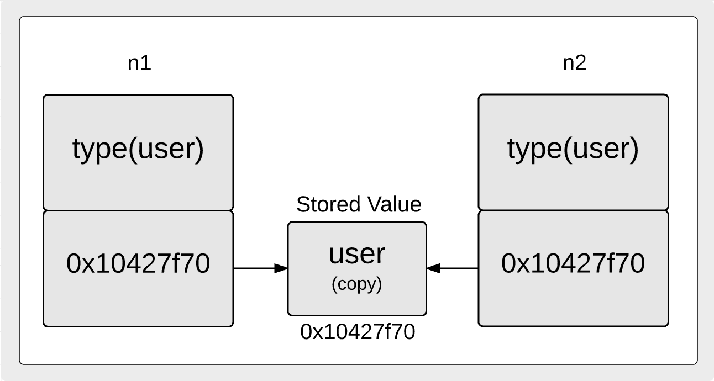
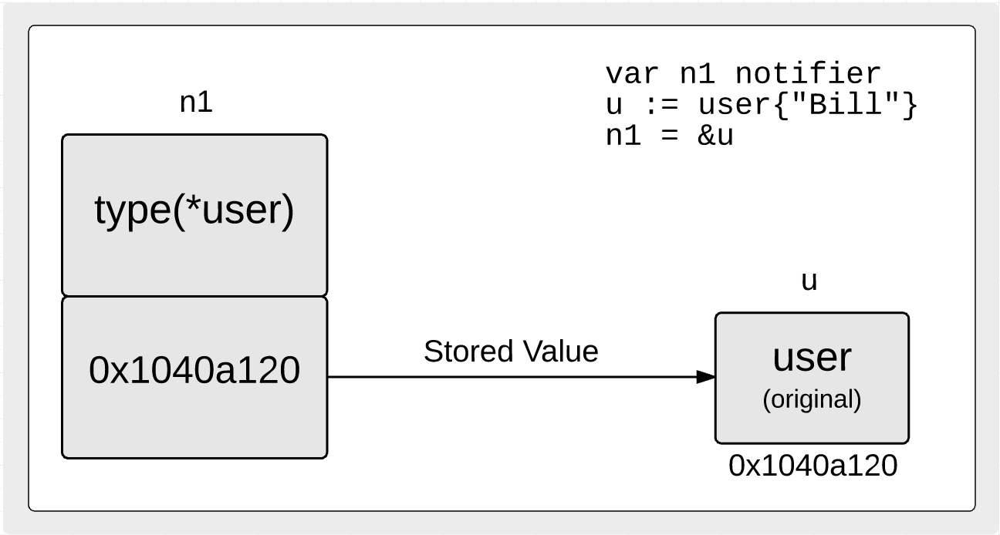

# Copying Interface Values In Go

<p align="right">William KennedyMay 5, 2016</p>

原文地址 ：[Copying Interface Values In Go](https://www.ardanlabs.com/blog/2016/05/copying-interface-values-in-go.html)

我一直在思考 Go 语言以及它是如何工作的。
最近我一直在思考 Go 中的一切都是值（`value`）。
当我们将值传递给函数，迭代切片和执行类型断言时，我们会看到这一点。
在每种情况下，都会返回存储在这些数据结构中的值的副本。
当我第一次开始学习 Go 时，这让我失望，但我开始意识到这给我们的代码带来了合理性。

我开始疑问，当我复制一个`interface`的值，存储值而不是指针地址的时候发生了什么？
每个新的`interface`的值会获得自己的副本，还是会共享该值？
为了获得明确的答案，我写了一个小程序来检查`interface Value`。

## Listing 1

```
06 package main
07
08 import (
09     "fmt"
10     "unsafe"
11 )
12
13 // notifier provides support for notifying events.
14 type notifier interface {
15     notify()
16 }
17
18 // user represents a user in the system.
19 type user struct{
20     name string
21 }
22
23 // notify implements the notifier interface.
24 func (u user) notify() {
25     fmt.Println("Alert", u.name)
26 }
```

在 Listing 1 中的第 14 行，我们看到了名为`notifier`的接口类型的声明，
其中包含一个名为`notify`的方法。
然后在第 19 行，我们有一个名为`user`的具体类型的声明，
在第 24 行有该`user`的`notify`程序接口的实现。
我们现在有一个接口和一个具体类型可以使用。

## Listing 2

```
28 // inspect allows us to look at the value stored
29 // inside the interface value.
30 func inspect(n *notifier, u *user) {
31     word := uintptr(unsafe.Pointer(n)) + uintptr(unsafe.Sizeof(&u))
32     value := (**user)(unsafe.Pointer(word))
33     fmt.Printf("Addr User: %p  Word Value: %p  Ptr Value: %v\n", u, *value, **value)
34 }
```

在 Listing 2 中，我们有从第 30 行开始的 `inspect` 函数。
这个函数为我们提供了一个指向接口值第二个字段的指针。
使用此指针，我们可以检查接口的第二个字段的值以及第二个字段指向的用户值。
我们需要检查这些值以真正理解`interface`的机制。

## Listing 3

```
36 func main() {
37
38     // Create a notifier interface and concrete type value.
39     var n1 notifier
40     u := user{"bill"}
41
42     // Store a copy of the user value inside the notifier
43     // interface value.
44     n1 = u
45
46     // We see the interface has its own copy.
47     // Addr User: 0x1040a120  Word Value: 0x10427f70  Ptr Value: {bill}
48     inspect(&n1, &u)
49
50     // Make a copy of the interface value.
51     n2 := n1
52
53     // We see the interface is sharing the same value stored in
54     // the n1 interface value.
55     // Addr User: 0x1040a120  Word Value: 0x10427f70  Ptr Value: {bill}
56     inspect(&n2, &u)
57
58     // Store a copy of the user address value inside the
59     // notifier interface value.
60     n1 = &u
61
62     // We see the interface is sharing the u variables value
63     // directly. There is no copy.
64     // Addr User: 0x1040a120  Word Value: 0x1040a120  Ptr Value: {bill}
65     inspect(&n1, &u)
66 }
```

Listing 3 显示了从第 36 行开始的 main 函数。
我们在第 39 行上做的第一件事就是将一个名为 n1 的接口类型`notifier`的变量声明为零值。
然后在第 40 行，我们声明一个名为`u`的变量，其类型为`user`设置其字符串为`bill`。

## Listing 4

```
42     // Store a copy of the user value inside the notifier
43     // interface value.
44     n1 = u
45
46     // We see the interface has its own copy.
47     // Addr User: 0x1040a120  Word Value: 0x10427f70  Ptr Value: {bill}
48     inspect(&n1, &u)
```

## Figure 1:

What the interface value looks like after the assignment of the user value.


Figure 1 显示了赋值后`interface`的值`value`的结构内容。
我们看到`interface`中的值`value`有自己的已分配用户值的副本。
存储在`interfacce`中的`user`值的地址与最初的`user`值的地址是完全不同。

我编写了这段代码，
以了解如果我将一个值而不是指针的值，赋值到`interface`中的时候发生了什么
这个新接口值是否也有自己的副本，或者值是否共享？

## Listing 5

```
50     // Make a copy of the interface value.
51     n2 := n1
52
53     // We see the interface is sharing the same value stored in
54     // the n1 interface value.
55     // Addr User: 0x1040a120  Word Value: 0x10427f70  Ptr Value: {bill}
56     inspect(&n2, &u)
```

## Figure 2:

What both interface values look like after copying the interface value.


Figure 2 为我们展示了答案。当我们 copy 一个值到`interface`中的时。
存储在`n1`内的`user`值现在与`n2`共享。每个接口值都没有获得自己的副本。它们都共享相同的用户值。

## Listing 6

```
58     // Store a copy of the user address value inside the
59     // notifier interface value.
60     n1 = &u
61
62     // We see the interface is sharing the u variables value
63     // directly. There is no copy.
64     // Addr User: 0x1040a120  Word Value: 0x1040a120  Ptr Value: {bill}
65     inspect(&n1, &u)
```

## Figure 3:

What the interface value looks like after the assignment of the address.



在 Figure 3 中，我们看到接口现在指向 u 变量引用的用户值。u 变量的地址是存储在接口值的第二个字内的。这意味着接口值将看到与 u 变量关联的用户值的任何更改。

## Conclusion

我允许自己对 Go 在进行存储值而不是指针的接口值的副本时会做什么感到困惑。有一分钟，我想知道接口值的每个副本是否也创建了接口引用的值的副本。因为我们“存储”一个值而不是一个指针。但我们学到的是，因为地址总是存储，所以它是被复制的地址，而不是值本身。
