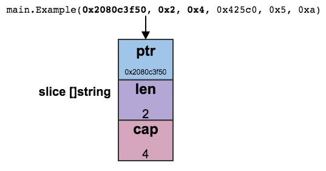
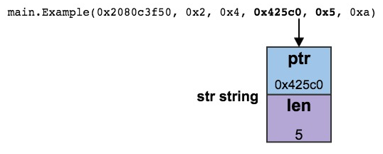

# Stack Traces In Go

<div><p align="right">author: William KennedyJanuary 11, 2015</p></div>

原文连接：[Stack Traces In Go](https://www.ardanlabs.com/blog/2015/01/stack-traces-in-go.html)

## Introduction
&emsp;&emsp;在Go语言中有一些调试技巧能帮助我们快速找到问题，有时候你想尽可能多的记录异常但仍觉得不够，
搞清楚堆栈的意义有助于定位Bug或者记录更完整的信息。
 
&emsp;&emsp;自从我开始编写Go以来，我一直在看堆栈跟踪。在某些时候，我们都做了一些愚蠢的事情，
导致运行时杀死我们的程序并抛出堆栈跟踪。
我将向您展示堆栈跟踪提供的信息，包括如何识别传递到每个函数的每个参数的值。
 
## Functions
让我们从一小段代码开始，它将产生堆栈跟踪:

### Listing 1 
```go
package main

func main() {
	slice := make([]string, 2, 4)
	Example(slice, "hello", 10)
}
func Example(slice []string, str string, i int) {
	panic("Want stack trace")
}
```

Listing 1显示了一个程序，
其中main函数在第05行调用Example函数。
Example函数在第08行声明并接受三个参数，一个字符串片段，一个字符串和一个整数。
Example执行的唯一代码是在第09行调用内置函数panic，它会立即生成堆栈跟踪：
###  Listing 2
```
Panic: Want stack trace

goroutine 1 [running]:
main.Example(0x2080c3f50, 0x2, 0x4, 0x425c0, 0x5, 0xa)
        /Users/bill/Spaces/Go/Projects/src/github.com/goinaction/code/
        temp/main.go:9 +0x64
main.main()
        /Users/bill/Spaces/Go/Projects/src/github.com/goinaction/code/
        temp/main.go:5 +0x85

goroutine 2 [runnable]:
runtime.forcegchelper()
        /Users/bill/go/src/runtime/proc.go:90
runtime.goexit()
        /Users/bill/go/src/runtime/asm_amd64.s:2232 +0x1

goroutine 3 [runnable]:
runtime.bgsweep()
        /Users/bill/go/src/runtime/mgc0.go:82
runtime.goexit()
        /Users/bill/go/src/runtime/asm_amd64.s:2232 +0x1
```

Listing 2中的堆栈跟踪显示了`panic`时存在的所有goroutine，
每个`routine`的状态以及相应`goroutine`下的调用堆栈。
正在运行的goroutine和导致堆栈跟踪的goroutine将位于顶部。
让我们专注于`panic`的`goroutine`。
###  Listing 3
```
goroutine 1 [running]:
main.Example(0x2080c3f50, 0x2, 0x4, 0x425c0, 0x5, 0xa)
        /Users/bill/Spaces/Go/Projects/src/github.com/goinaction/code/
        temp/main.go:9 +0x64
main.main()
        /Users/bill/Spaces/Go/Projects/src/github.com/goinaction/code/
	    temp/main.go:5 +0x85
```

Listing 3中第01行的堆栈跟踪显示`goroutine 1`在`panic`之前运行。
在第02行，我们看到`panic`的代码在包`main`中的`Example`函数中。
缩进的行显示了此函数所在的代码文件和路径，以及正在执行的代码行。
在这种情况下，第09行的代码正在运行，这是对`panic`的调用。

第03行显示调用`Example`的函数的名称。
这是`main`包中的`main`函数。
在函数名称下面，缩进的行显示了对`Example`进行调用的代码文件，路径和代码行。

堆栈跟踪显示该`goroutine`范围内的函数调用链，直到发生`panic`时。
现在，让我们关注传递给`Example`函数的每个参数的值：
###  Listing 4 
```
// Declaration
main.Example(slice []string, str string, i int)

// Call to Example by main.
slice := make([]string, 2, 4)
Example(slice, "hello", 10)

// Stack trace
main.Example(0x2080c3f50, 0x2, 0x4, 0x425c0, 0x5, 0xa)
```

Listing 4显示了当`main`调用和函数声明时，传递给`Example`函数的堆栈跟踪的值。
将堆栈跟踪中的值与函数声明进行比较时，它似乎不匹配。`Example`函数的声明接受三个参数，
但堆栈跟踪显示六个十六进制值。理解值如何与参数匹配的关键需要知道每个参数类型的实现。

让我们从第一个参数开始，这是一个字符串切片。切片是Go中的引用类型。
这意味着切片的值是带有指向某些基础数据的指针的数据结构。
在切片的情况下，这种数据结构域是三个字段结构，其包含指向底层数组的指针，切片的长度和容量。
与切片数据结构相关联的值由堆栈跟踪中的前三个值表示：
###  Listing 5
```
// Slice parameter value
slice := make([]string, 2, 4)

// Slice header values
Pointer:  0x2080c3f50
Length:   0x2
Capacity: 0x4

// Declaration
main.Example(slice []string, str string, i int)

// Stack trace
main.Example(0x2080c3f50, 0x2, 0x4, 0x425c0, 0x5, 0xa)
```

Listing 5显示了堆栈跟踪中的前三个值如何与slice参数匹配。
第一个值表示指向基础字符串数组的指针。
用于初始化切片的长度和容量数与第二个和第三个值匹配。
这三个值表示切片标头的每个值，即第一个参数。

###  Figure 1



<h6>figure provided by Georgi Knox</h6>

现在让我们看一下字符串类型的第二个参数
字符串也是引用类型，但是第一个参数是不可变的。
字符串的第一个参数为声明时的两个字段结构，包含指向底层字节数组的指针和这个字符串的长度：

###  Listing 6

```
// String parameter value
"hello"

// String header values
Pointer: 0x425c0
Length:  0x5

// Declaration
main.Example(slice []string, str string, i int)

// Stack trace
main.Example(0x2080c3f50, 0x2, 0x4, 0x425c0, 0x5, 0xa)
```
Listing 6显示了堆栈跟踪中的第四个和第五个值如何与string参数匹配。
第四个值表示指向底层字节数组的指针，第五个值表示字符串的长度为5。
字符串“hello”需要5个字节。
这两个值表示每个字符串结构的两个参数值。

###  Figure 2


<h6>figure provided by Georgi Knox</h6>

第三个参数是一个整数类型，它是一个单个字段的值：
###  Listing 7
```
// Integer parameter value
10

// Integer value
Base 16: 0xa

// Declaration
main.Example(slice []string, str string, i int)

// Stack trace
main.Example(0x2080c3f50, 0x2, 0x4, 0x425c0, 0x5, 0xa)
```

Listing 7显示了堆栈跟踪中的最后一个值是如何与整数参数匹配。
跟踪中的最后一个值是十六进制数0xa，它是值10。
与该参数传递的值相同。该值代表第三个参数。

###  Figure 3


<h6>figure provided by Georgi Knox</h6>
## Methods
让我们更改程序，以便`Example`函数现在是一个方法：

###  Listing 8
```
package main

import "fmt"

type trace struct{}

func main() {
    slice := make([]string, 2, 4)
    var t trace
    t.Example(slice, "hello", 10)
}

func (t *trace) Example(slice []string, str string, i int) {
    fmt.Printf("Receiver Address: %p\n", t)
    panic("Want stack trace")
}
```

Listing 8通过在第05行声明一个名为`trace`的新类型并将`Example`函数转换为一个在第14行的一个方法来修改原始程序。
这个转换通过重新申明成一个指针接受者的`trace`类型的函数来完成。
然后在第10行，名为t的变量声明为trace类型，并且使用第11行上的变量进行方法调用。

由于该方法是使用指针接收者声明的，因此Go将获取`t`变量的地址以支持接收者的类型，即使方法调用是使用值进行的。
这次运行程序时，堆栈跟踪有点不同：

###  Listing 9
```
Receiver Address: 0x1553a8
panic: Want stack trace

01 goroutine 1 [running]:
02 main.(*trace).Example(0x1553a8, 0x2081b7f50, 0x2, 0x4, 0xdc1d0, 0x5, 0xa)
           /Users/bill/Spaces/Go/Projects/src/github.com/goinaction/code/
           temp/main.go:16 +0x116

03 main.main()
           /Users/bill/Spaces/Go/Projects/src/github.com/goinaction/code/
           temp/main.go:11 +0xae
```

Listing 9中你应该注意的第一件事是第02行的堆栈跟踪清楚这是一个使用指针接收者的方法调用。
现在，函数的名称在包名称和方法名称之间显示`(* trace)`。
要注意的第二件事是值列表现在如何首先显示接收者的值。
方法调用实际上是函数调用，第一个参数是接收者值。我们从堆栈跟踪中看到了这个实现细节。

由于声明或调用`Example`方法没有其他任何更改，因此所有其他值保持不变。
调用`Example`行号和发生`panic`的位置发生了变化并反映了新代码。

## Packing
当您有一个字段里含有多个参数时，堆栈跟踪中的参数值将被打包在一起：

###  Listing 10
```
 package main

func main() {
    Example(true, false, true, 25)
}

func Example(b1, b2, b3 bool, i uint8) {
    panic("Want stack trace")
}
```

Listing 10显示了一个新的示例程序，它将`Example`函数更改为接受四个参数。
前三个是布尔值，最后一个是八位无符号整数。
布尔值也是一个8位值，因此所有四个参数都适合32位和64位架构上的单个字。
程序运行时会产生一个有趣的堆栈跟踪：

###  Listing 11

```
01 goroutine 1 [running]:
02 main.Example(0x19010001)
           /Users/bill/Spaces/Go/Projects/src/github.com/goinaction/code/
           temp/main.go:8 +0x64
03 main.main()
           /Users/bill/Spaces/Go/Projects/src/github.com/goinaction/code/
           temp/main.go:4 +0x32
```

对于对Example的调用，堆栈跟踪中没有四个值，而是有一个值。所有四个单独的8位值被打包成一个单词：

###  Listing 12

```
// Parameter values
true, false, true, 25

// Word value
Bits    Binary      Hex   Value
00-07   0000 0001   01    true
08-15   0000 0000   00    false
16-23   0000 0001   01    true
24-31   0001 1001   19    25

// Declaration
main.Example(b1, b2, b3 bool, i uint8)

// Stack trace
main.Example(0x19010001)
```
Listing 12显示了堆栈跟踪中的值如何与传入的所有四个参数值匹配。
`true`值是一个8位值，用值`1`表示，`false`值用值表示`0`.`25`的二进制表示是`11001`，十六进制转换为`19`。
现在，当我们查看堆栈跟踪中表示的十六进制值时，我们会看到它如何表示传入的值。
## Conclusion

Go运行时提供了大量信息来帮助我们调试程序。
在这篇文章中，我们专注于堆栈跟踪。
解码在整个调用堆栈中传递给每个函数的值的能力是巨大的。
它不止一次帮助我很快识别我的错误。
既然您已经知道如何读取堆栈跟踪，那么希望您可以在下次发生堆栈跟踪时利用这些知识。