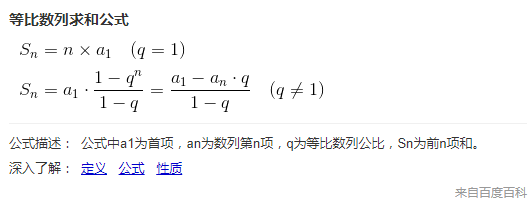

# Hei。 Blogs

&emsp;&emsp;Principe University Algorithm Course And Blogs

## 简介

&emsp;&emsp;数据结构、算法的学习之路，后续发展成随笔记录

## 目录说明

* [Golang文章翻译](https://github.com/hei6775/HeiBlogs/tree/master/GoVersion)
> 英文文章翻译以及不错的文章记录

* [beego源码分析](https://github.com/hei6775/HeiBlogs/tree/master/Beego)
> beego 小部分源码，主要为 log 模块和 tool 模块

* [Leaf源码分析](https://github.com/hei6775/GoLeafServer)
> leaf框架的源码分析，基于本身的游戏项目进行一定程度的分析

* [A 星寻路算法](https://github.com/hei6775/HeiBlogs/tree/master/Astar)
> 轻量简易版的A*算法golang实现

* [数据库部分](https://github.com/hei6775/HeiBlogs/tree/master/DB)
> mysql mongodb redis

* [网络部分](https://github.com/hei6775/HeiBlogs/tree/master/Protocol)

* [ZooKeeper](https://github.com/hei6775/HeiBlogs/tree/master/Zk)

* [个人随笔](https://github.com/hei6775/HeiBlogs/tree/master/Recoder)

* [GO源码分析](https://github.com/hei6775/HeiBlogs/tree/master/GoSources)

## 记录

## Golang 的 HTTP

1.目前我知道 http.Request.Body 可以获取上传之后的文件具体内容，并且它是一个 io.ReadCloser 类型

2.再问一下 http.Request.Body 是服务器这边全部接收到了内容之后才能读取到吗？

3.http.Request.ContentLength 是如何得到的，是服务器这边全部接收到了内容之后算的？还是客户端那边带过来的

答：

如果文件很大,分片上传即可,在客户端分片,最后在服务器端组合成原文件,可以看看某些 CDN api 的实现,比如阿里云 CDN 等都有分片上传的实现.因为大文件直接上传时,碰到网络中断后就要重新开始, 那就要吐血了.

http.Request.ContentLength 是客户端实现的,有兴趣,就翻翻源码.

http.Request.Body 无需全部接收到了内容之后才能读取,但读取过程是阻塞的.

上传文件即是将文件编码为 multipart/form-data 后再放到 http.body 里进行上传,当 http.body 过大时,底层的 tcp 会分段进行传输.因此上传一个大文件,用 for 和小的 buffer 进行循环读取即可验证该过程.而且我说的"读取过程是阻塞的"是指客户端在传输过程中突然停止,服务端没数据可读时也会阻塞住.

## Golang 的内存分配

Golang 运行时的内存分配算法主要源自 Google 为 C 语言开发的`TCMalloc`算法，全称`Thread-CachingMalloc`。
核心思想就是把内存分为多级管理，从而降低锁的粒度。
它将可用的堆内存采用二级分配的方式进行管理：每个线程都会自行维护一个独立的内存池，进行内存分配时优先从该内存池中分配，
当内存池不足时才会向全局内存池申请，以避免不同线程对全局内存池的频繁竞争。

Go 在程序启动的时候，会先向操作系统申请一块内存（注意这时还只是一段虚拟的地址空间，并不会真正地分配内存），切成小块后自己进行管理。

- spans 区域
- bitmap 区域
- arena 区域
- mspan
- mcache
- mcentral
- mheap

&emsp;&emsp;内存池，垃圾回收。

> #### 内存池

- 动态分配内存大小

&emsp;&emsp;

- 每条线程都会有自己的本地的内存，然后还有一个全局的分配链

&emsp;&emsp;

- 两级内存管理结构，MHeap 和 MCache

&emsp;&emsp;MHeap 用于分配大对象，每次分配都是若干连续的页，也就是若干个 4KB 的大小。使用的数据结构是 MHeap 和 MSpan，用 BestFit 算法做分配，
用位示图做回收。

&emsp;&emsp;MCache 用于管理的基本单位是不同类型的固定大小的对象，更像是一个对象池而不是内存池，用引用计数做回收。

> #### 垃圾回收

## Others

## 等比数列 等差数列

## Links

[网络计算机基础篇](https://hit-alibaba.github.io/interview/basic/network/HTTP.html)

[深入理解 Go Slice](https://mp.weixin.qq.com/s?__biz=MjM5OTcxMzE0MQ==&mid=2653371806&idx=1&sn=37cdffa7b5ec5bfb901455bb3997a040&chksm=bce4dd848b9354929adecd85d1b502f381a60ae36ecdd69c320942a367fbeb417a48a87c60c8&scene=21##)

[图解 Go 语言内存分配](https://mp.weixin.qq.com/s/Hm8egXrdFr5c4-v--VFOtg)

[Go 语言实战笔记（二十七）| Go unsafe Pointer](https://www.flysnow.org/2017/07/06/go-in-action-unsafe-pointer.html)

[Go 语言经典库使用分析（八）| 变量数据结构调试利器 go-spew](https://www.flysnow.org/2019/02/03/golang-classic-libs-go-spew.html)

[有点不安全却又一亮的 Go unsafe.Pointer](https://blog.csdn.net/RA681t58CJxsgCkJ31/article/details/85241470)

[Go 语言性能优化- For Range 性能研究](https://www.flysnow.org/2018/10/20/golang-for-range-slice-map.html)

[深入 Golang Runtime 之 Golang GC 的过去,当前与未来](https://www.jianshu.com/p/bfc3c65c05d1)

[Golang 使用指针来操作结构体就一定更高效吗？](https://medium.com/@blanchon.vincent/go-should-i-use-a-pointer-instead-of-a-copy-of-my-struct-44b43b104963)
